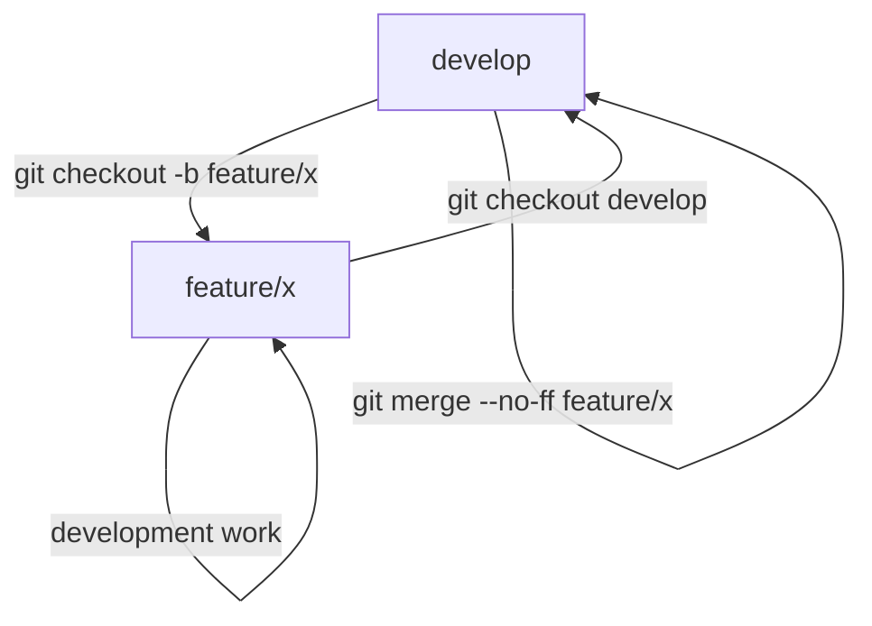
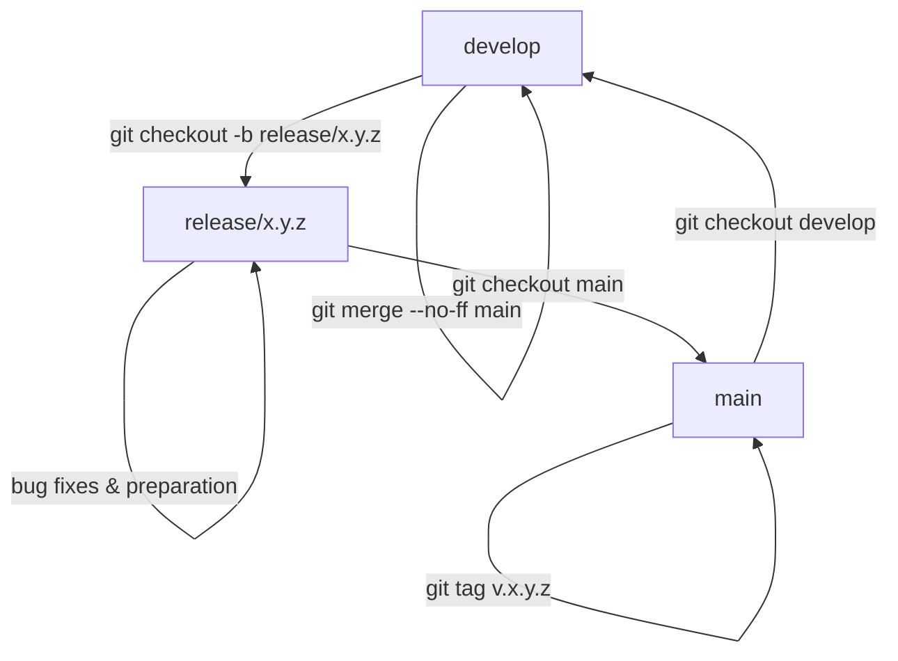
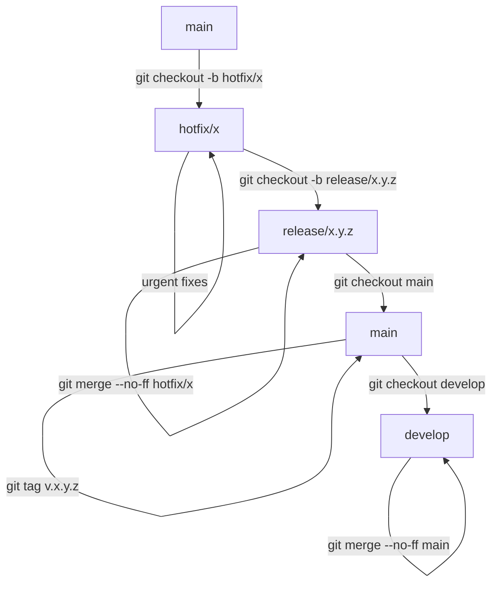

# Git Workflow Documentation

## Overview

This document describes the Git workflow established for the `@hackettyam/api-middleware` project. The workflow is designed to maintain a clear and organized development process, ensure code quality, and facilitate the release process.

## Branch Structure

Our workflow is built around the following branch structure:

| Branch Type | Naming Convention      | Purpose                                                      |
| ----------- | ---------------------- | ------------------------------------------------------------ |
| `main`      | `main`                 | Production-ready code. Protected branch.                     |
| `develop`   | `develop`              | Active development branch. All features are integrated here. |
| `feature`   | `feature/feature-name` | New feature development.                                     |
| `release`   | `release/x.y.z`        | Preparing a new release with version number.                 |
| `hotfix`    | `hotfix/fix-name`      | Urgent fixes for production issues.                          |

## Branch Protection Rules

- **Main Branch Protection**: The `main` branch is protected and only accepts changes from:
  - `release/*` branches
- **No Direct Commits**: Direct commits to `main` are not allowed. All changes must go through the proper workflow.

- **Non-Fast-Forward Merges**: All integrations use `--no-ff` to maintain a clear history and enable easy rollback if needed.

## Workflow Processes

### Feature Development



1. **Start a feature**:
   ```bash
   pnpm release:feature:start feature-name
   ```

````
   This creates a new branch `feature/feature-name` from `develop`.

2. **Develop the feature**:
   Make all necessary commits on the feature branch following the commit message conventions.

3. **Finish the feature**:
   ```bash
pnpm release:feature:finish feature/feature-name
````

This merges the feature branch back into `develop` with `--no-ff` flag.

### Release Process



1. **Prepare a release**:

   You can prepare a release in two ways:

   **Standard way** (using current version):

   ```bash
   pnpm release:prepare
   ```

````
   This creates a new branch `release/x.y.z` from `develop`, where x.y.z is the current version in package.json.

   **Recommended way** (update version and create branch in one step):
   ```bash
pnpm release:start minor  # For minor version bump (0.1.0 -> 0.2.0)
pnpm release:start major  # For major version bump (0.1.0 -> 1.0.0)
pnpm release:start patch  # For patch version bump (0.1.0 -> 0.1.1)
````

These commands update the version in package.json and create a release branch with the new version number.

2. **Make release-specific adjustments**:

   - Bug fixes
   - Documentation updates
   - Version adjustments
   - Final testing

3. **Finish the release**:
   ```bash
   pnpm release:finish
   ```

````
   This process:
   - Merges the release branch into `main`
   - Generates the CHANGELOG.md (using `release:changelog`)
   - Creates the release commit and version tag (using `release:tag`)
   - Merges changes back to `develop`

   You can also execute these steps individually:
   ```bash
   # Only generate the changelog with the most recent changes without modifying the version or creating tags
   pnpm release:changelog

   # Only create the release commit and tag without regenerating the changelog
   pnpm release:tag
````

### Hotfix Process



1. **Start a hotfix**:
   ```bash
   pnpm release:hotfix:start hotfix-name
   ```

````
   This creates a new branch `hotfix/hotfix-name` from `main`.

2. **Implement the fix**:
   Make the necessary changes to fix the issue.

3. **Create a release branch for the hotfix**:
   ```bash
pnpm release:hotfix:prepare hotfix/hotfix-name
````

This creates a new release branch with the hotfix changes.

4. **Finish the release with the hotfix**:
   ```bash
   pnpm release:finish
   ```

```
   This process:
   - Merges the release branch (containing the hotfix) into `main`
   - Generates a changelog
   - Creates a version tag
   - Merges changes back to `develop`

## Commit Message Conventions

We follow the [Conventional Commits](https://www.conventionalcommits.org/) specification:

```

<type>(<scope>): <description>

[optional body]

[optional footer(s)]

````

### Types

- `feat`: A new feature
- `fix`: A bug fix
- `docs`: Documentation changes
- `style`: Code style changes (formatting, etc.)
- `refactor`: Code changes that neither fix bugs nor add features
- `perf`: Performance improvements
- `test`: Adding or fixing tests
- `chore`: Changes to the build process or auxiliary tools

### Example Commit Messages

- `feat(auth): Add JWT authentication support`
- `fix(validation): Resolve issue with number validation`
- `docs(api): Update API documentation`
- `chore(deps): Update dependencies`

## Quality Control Hooks

The repository uses Git hooks to ensure code quality:

### Pre-commit Hook

The pre-commit hook runs automatically before each commit to ensure code quality:
- **Linting**: ESLint checks for code quality issues
- **Formatting**: Prettier ensures consistent code formatting

### Commit Message Hook

The commit-msg hook validates commit messages to ensure they follow the Conventional Commits format.

## Tools and Dependencies

- **Husky**: For managing Git hooks
- **Commitlint**: For validating commit messages
- **Lint-staged**: For running linters on staged files
- **Standard-version**: For versioning and changelog generation

## CI/CD Integration

When integrated with CI/CD, this workflow enables:
- Automated testing for each feature
- Release candidate builds from release branches
- Production deployment from the main branch
- Automated documentation generation

## Best Practices

1. **Keep feature branches short-lived**: Merge frequently to avoid divergence
2. **Write meaningful commit messages**: They generate your changelog
3. **Review code before merging**: Use pull requests for all significant changes
4. **Test thoroughly in release branches**: Ensure quality before merging to main
5. **Document significant changes**: Update documentation alongside code changes

## Scripts Reference

All release workflow commands have been moved to a modular TypeScript script structure. The main commands are:

```bash
# View all available commands
pnpm release

# Feature workflow
pnpm release:feature:start <name>
pnpm release:feature:finish <branch>

# Release workflow
pnpm release:prepare
pnpm release:start <minor|major|patch>
pnpm release:finish

# Version management
pnpm version:minor
pnpm version:major
pnpm version:patch
pnpm version:changelog
pnpm version:tag

# Hotfix workflow
pnpm release:hotfix:start <name>
pnpm release:hotfix:prepare <branch>
````

"feature:start": "git checkout develop && git checkout -b feature/",
"feature:finish": "git checkout develop && git merge --no-ff $npm_config_branch",
"hotfix:start": "git checkout main && git checkout -b hotfix/",
"hotfix:prepare": "git checkout -b release/$(node -e \"console.log(require('./package.json').version)\")-hotfix && git merge --no-ff $npm_config_branch"

```

```
